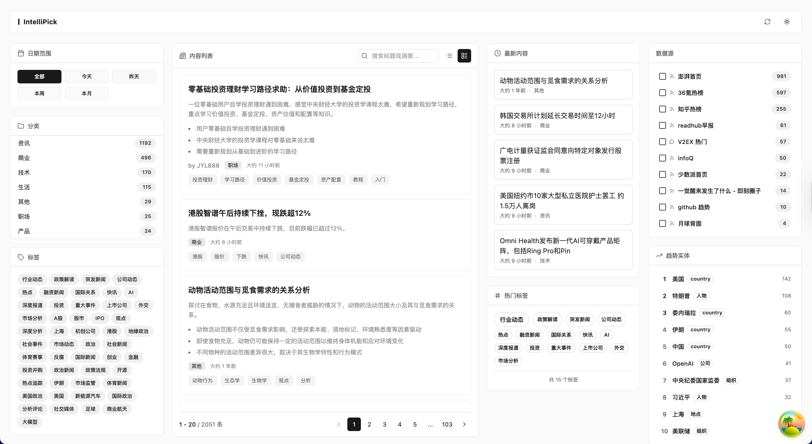
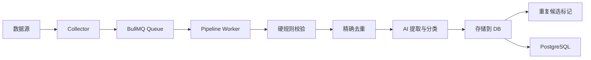

<div align="center">

# Sift（知拾）

### AI 驱动的内容聚合与结构化提取系统

[](https://opensource.org/licenses/MIT)
[](https://nodejs.org)
[](https://pnpm.io)
[](https://www.typescriptlang.org)

**Sift（知拾）** 从 RSS、V2EX 等来源采集内容，通过硬规则与精确去重清理重复数据，再使用 AI 生成摘要、分类、标签和实体信息。

[功能特性](#-核心特性) • [快速开始](#-快速开始) • [架构设计](#-架构设计) • [API 文档](#-api-文档)

</div>

---

## 🌟 项目亮点

- **内容净化** - 硬规则校验、同源精确去重和跨来源重复候选识别
- **AI 结构化** - 自动生成摘要、关键要点、分类、标签和实体关联
- **职位聚合** - 采集招聘信息并支持岗位方向、技能、收藏和投递状态管理
- **插件化架构** - 可扩展新的数据源和处理步骤
- **多种接口** - RESTful、GraphQL、AI Chat 和 WebSocket 实时推送
- **异步处理** - BullMQ 队列支持并发、限速和失败记录
- **现代化前端** - React 18、Vite 6 和 Tailwind CSS 4

---

## 📸 项目截图

### Web 界面


---

## 🚀 技术栈

### 核心技术
[](https://www.typescriptlang.org/)
[](https://nodejs.org)
[](https://pnpm.io)
[](https://turbo.build)

### 数据库与队列
[](https://www.postgresql.org)
[](https://redis.io)
[](https://orm.drizzle.team)
[](https://docs.bullmq.io)

### AI 与机器学习
[](https://sdk.vercel.ai)
[](https://www.deepseek.com)

### 后端框架
[](https://fastify.io)
[](https://mercurius.dev)
[](https://socket.io)

### 前端技术
[](https://react.dev)
[](https://vitejs.dev)
[](https://tailwindcss.com)
[](https://tanstack.com/query)

### 开发工具
[](https://biomejs.dev)

---

## 🏗️ 架构设计

### Monorepo 结构

```
intellipick/
├── apps/
│   ├── api/                  # HTTP API 服务器 (Fastify + GraphQL + Socket.IO)
│   ├── worker/               # 后台处理系统 (Collector + Pipeline + Scheduler)
│   └── web/                  # React 前端应用 (Vite + React Router)
├── packages/
│   ├── config/               # 配置加载和验证 (jiti + zod)
│   ├── db/                   # 数据库 schema 和客户端 (Drizzle ORM)
│   ├── env/                  # 环境变量验证
│   ├── events/               # Worker-API 事件通信
│   └── shared/               # 共享类型定义和工具函数
└── docs/                     # 项目文档
```

### 核心工作流程



**Worker（后台处理）:**
1. **采集 (Collector)** - 插件化架构，支持 RSS、V2EX 等
2. **队列 (Queue)** - BullMQ + Redis，支持优先级和延迟任务
3. **处理管道 (Pipeline)** - 顺序执行的步骤链
4. **调度 (Scheduler)** - Cron 定时任务，支持每个数据源独立间隔

**API（HTTP 服务）:**
- RESTful API - 标准的 HTTP 端点
- GraphQL API - 灵活的查询接口
- WebSocket - Socket.IO 实时推送新内容
- AI Chat - 自然语言查询接口

**Web（前端应用）:**
- 响应式设计，支持移动端
- 实时更新，WebSocket 连接
- 内容浏览和搜索

---

## 📦 快速开始

### 环境要求

- Node.js 18+
- PostgreSQL 16
- Redis 7
- pnpm 9+

### NAS 正式发布

Mac mini 从已推送的干净 Git commit 构建 NAS 对应的 AMD64 镜像，通过校验后的镜像归档交付；NAS 只加载并运行版本化镜像，不再使用源码执行构建：

```bash
scripts/deploy-nas-images.sh
```

回滚到 NAS 已保留的版本：

```bash
scripts/rollback-nas-images.sh <commit-sha>
```

完整的发布边界、manifest 和回滚说明见 [`docs/nas-image-deployment.md`](docs/nas-image-deployment.md)。

### 通用 Docker 部署

```bash
# 克隆仓库
git clone https://github.com/Shadowzzh/intelli-pick.git intellipick
cd intellipick

# 准备生产环境变量并填写数据库密码、AI Key 等必需配置
cp .env.example .env.production

# 在目标机器构建镜像
docker compose --env-file .env.production build

# 首次部署先启动基础设施，再执行一次数据库迁移
docker compose --env-file .env.production up -d intellipick-db intellipick-redis
docker compose --env-file .env.production --profile tools run --rm intellipick-migrate

# 启动 API、Web、Worker 和 RSSHub
docker compose --env-file .env.production up -d

# 查看日志
docker compose --env-file .env.production logs -f

# 停止服务
docker compose --env-file .env.production down
```

服务启动后：
- API 服务器：http://localhost:8085
- Web 应用：http://localhost:8080
- RSSHub：http://127.0.0.1:1200
- GraphQL 端点：http://localhost:8085/graphql（生产环境默认关闭 GraphiQL 和内省）

### 本地开发

```bash
# 安装依赖
pnpm install

# 配置环境变量
cp .env.example .env
# 编辑 .env 填入你的配置

# 初始化数据库
pnpm db:push

# 启动所有服务（开发模式）
pnpm dev
```

### 配置

编辑根目录的 `config.ts`:

```typescript
export default defineConfig({
  ai: {
    providers: {
      codex: {
        type: "openai",
        protocol: "responses",
        baseUrl: "http://127.0.0.1:18090",
        baseUrlEnv: "SUB2API_BASE_URL",
        apiKeyEnv: "SUB2API_API_KEY",
      },
    },
    tasks: {
      extractAndClassify: {
        provider: "codex",
        model: "gpt-5.6-terra",
      },
    },
  },
  sources: [
    {
      name: "Hacker News",
      type: "rss",
      enabled: true,
      fetchInterval: 3600, // 每小时采集一次
      config: {
        url: "https://hnrss.org/frontpage",
      },
    },
    // 添加更多数据源...
  ],
  filter: {
    hardRules: {
      enabled: true,
      blacklistDomains: [],
      spamKeywords: [],
    },
  },
  // ...更多配置
});
```

---

## 📚 API 文档

Sift 提供三种 API 接口：

### RESTful API

```bash
# 健康检查
GET /health

# 获取内容列表（支持分页和过滤）
GET /api/v1/contents?page=1&limit=20

# 获取单个内容详情
GET /api/v1/contents/:id

# 获取热门实体
GET /api/v1/entities?limit=10

# 全文搜索
POST /api/v1/search
{
  "query": "AI and machine learning",
  "limit": 20
}

# AI 自然语言对话
POST /api/v1/ai/chat
{
  "message": "最近关于 GPT-4 的文章有哪些？"
}
```

### GraphQL API

访问 http://localhost:8085/graphql 打开 GraphQL Playground。

```graphql
query GetContentsWithEntities($limit: Int!) {
  contents(limit: $limit, orderBy: { publishedAt: desc }) {
    id
    title
    url
    summary
    publishedAt
    source {
      name
      type
    }
    entities {
      id
      name
      type
    }
  }
}
```

### WebSocket 实时推送

```typescript
import { io } from 'socket.io-client';

const socket = io('http://localhost:8085');

// 监听新内容事件
socket.on('content:new', (content) => {
  console.log('新内容:', content);
});

// 监听内容更新事件
socket.on('content:updated', (content) => {
  console.log('内容更新:', content);
});
```

---

## 🎯 核心功能

### 1. 内容净化与结构化

普通内容进入 Worker 后依次执行：

1. 硬规则校验域名、关键词和内容完整性。
2. 按 URL 或同一来源的外部 ID 执行精确去重。
3. 调用一次 `extractAndClassify`，生成标题、摘要、关键要点、分类、标签和实体。
4. 内容入库后记录跨来源近似重复候选，不自动删除或合并内容。

活动 Pipeline 不再执行 AI 质量评分，也不会把内容写入隔离区。数据库中的历史过滤字段继续保留，用于兼容旧数据。

### 2. 实体提取与关联

自动识别并提取关键实体：

```typescript
// 实体提取示例
{
  entities: [
    { name: "GPT-4", type: "product", confidence: 0.95 },
    { name: "OpenAI", type: "company", confidence: 0.98 },
    { name: "Sam Altman", type: "person", confidence: 0.92 }
  ]
}
```

**实体类型：**
- 人物（person）
- 公司（company）
- 产品（product）
- 项目（project）
- 技术（technology）

### 3. 多源数据采集

支持的数据源类型：

| 类型 | 插件 | 配置示例 |
|------|------|----------|
| RSS | `rss` | 标准 RSS/Atom feeds，可选 Node 或 curl 获取方式 |
| V2EX | `v2ex` | V2EX 最新主题 |

**添加新数据源：**

```typescript
// config.ts
{
  name: "我的博客",
  type: "rss",
  enabled: true,
  fetchInterval: 7200,
  config: {
    url: "https://myblog.com/rss"
  }
}
```

### 4. 实时推送

基于 Socket.IO 的实时内容推送：

- 新内容到达时立即推送到前端
- 支持 WebSocket 长连接，自动重连
- 事件驱动架构，高效可靠

### 5. AI 性能监控

监控页展示最近 24 小时的真实 AI 调用指标：

- 实体提取与分类的调用次数、成功率和平均响应时间
- 输入、输出、缓存、推理和总 token
- 配置模型与上游实际响应模型

详细口径、运行状态和回滚方法见 [`docs/ai-performance-monitoring.md`](docs/ai-performance-monitoring.md)。

### 6. 数据源健康与运行控制

监控页支持直接启用或停用数据源。运行状态持久化到数据库，容器重启不会覆盖用户选择；采集成功、失败、错误、数量和耗时会实时回写。

详细状态口径、API 和回滚方法见 [`docs/source-health-control.md`](docs/source-health-control.md)。

### 7. 统一任务详情

队列任务仍存在时展示实时 BullMQ 信息；任务完成并移除后自动回退到 PostgreSQL 执行历史，不需要用户手动切换位置查找。

详细查询流程、重试策略和验证记录见 [`docs/task-detail-fallback.md`](docs/task-detail-fallback.md)。

---

## 🔧 常用命令

### 开发

```bash
pnpm dev                 # 开发模式运行所有包
pnpm build              # 构建所有包
pnpm typecheck          # 类型检查
```

### 代码质量

```bash
pnpm lint               # 检查代码风格
pnpm lint:fix           # 自动修复代码风格问题
pnpm format             # 格式化代码
```

### 数据库

```bash
pnpm db:generate        # 生成迁移文件
pnpm db:migrate         # 运行迁移
pnpm db:push            # 直接推送 schema（开发用）
pnpm db:studio          # 打开 Drizzle Studio
```

### Redis & 队列

```bash
pnpm redis:status       # 查看 Redis 和队列状态
```


## 📊 项目统计


## 📄 许可证

本项目采用 MIT 许可证 - 详见 [LICENSE](LICENSE) 文件。
